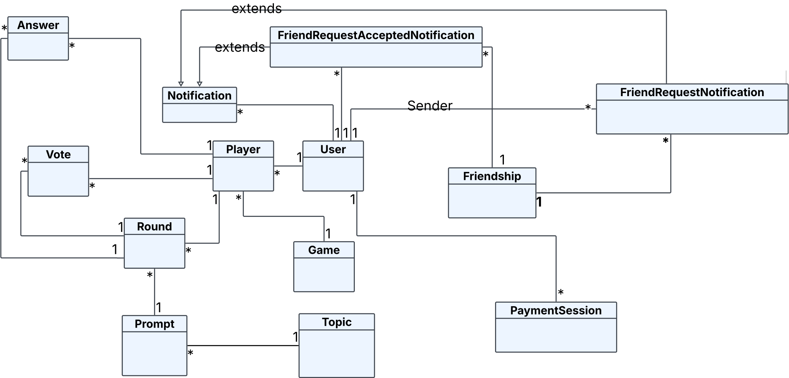
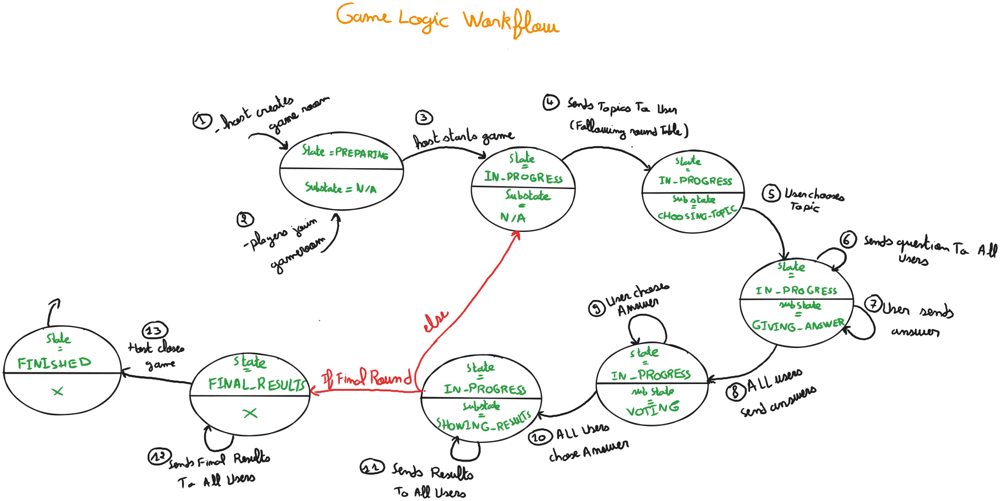

# Deception Game

## Description

The Deception Game API is a backend for a multiplayer bluffing game where players submit convincing lies to fill in missing answers and then vote to identify the true response. Built with NestJS and TypeORM, it exposes both REST and GraphQL endpoints. Real-time game flow is powered by WebSockets, Server-Sent Events (SSE) deliver live notifications (e.g., friend request, invite to lobby...). Additionally, secure payment processing is handled via webhook endpoint for premium purchase.

**Key Features:**

* Multiplayer game rounds: submit lies to questions, vote on answers, track scores
* Hybrid API: REST (traditional endpoints) and GraphQL (flexible queries/mutations)
* WebSockets for live game updates and synchronization
* SSE for push notifications
* Webhooks to securely receive payment events (with Stripe)
* Session-based authentication with passport and role-based access control

## Gameplay Example
Let’s walk through an example round of the game.

One of the players is chosen to pick a topic, they choose geography,  and the game randomly selects the following question from database: *What is the capital of Germany?*

Players now submit their fake answers (lies).

* Player 1 submits *Frankfurt*
* Player 2 submits *Munich*
* Player 3 submits *Hannover*

The game does **not** allow players to submit the correct answer, *Berlin*.

After all players submit their lies, the game displays all the fake answers along with the correct one (*Berlin*). At this point, players must try to choose the correct answer. If they don't know it, they have to guess.

Once this phase is over, scores are updated. If a player chooses another player’s lie—for example, if Player 1 picks *Munich* (submitted by Player 2)—then Player 2 earns points for successfully fooling Player 1.

After scoring, the round ends.

## Technical Details

### Entities Diagram

---

### Justification for Use of REST & GraphQL

**REST** is used for classic endpoints where the payloads and behavior are simple, predictable, and well-defined. This includes things like authentication, webhooks, and the Server-Sent Events (SSE) endpoint. These endpoints don’t require complex data querying or nested responses.

**GraphQL** is used for parts of the system that deal with game-related data and require complex or flexible queries. It's particularly useful when we need to fetch nested or relational data in a single request, avoiding over-fetching or under-fetching. For example, on the landing page, we need to retrieve various types of data like available lobbies, game history, friends, and notifications. Additionally, GraphQL makes complex mutations easier to manage, especially in CRUD operations across different game features.

---

### Event-Driven API Technologies

#### Server-Sent Events (SSE)

SSE is used to send real-time notifications to authenticated users. Notifications include:

* Received friend request
* Accepted friend request
* Lobby invitation

SSE is a good fit for this use case because it's unidirectional (server → client), which suits notification delivery perfectly.

#### Webhooks

Webhooks are used for Stripe payments. Our platform offers a one-time purchase of a lifetime premium status, which unlocks privileges such as more game topics and additional rounds. Stripe uses webhooks to notify our backend of successful transactions.

#### WebSockets

The main game loop is implemented using WebSockets. Since this is a real-time multiplayer game, WebSockets are essential for enabling continuous two-way communication between the server and all connected players.

---

### Game Logic Workflow

1. A user hosts a game
   **State: `PREPARING` | Substate: `N/A`**

2. Players join the game
   **State: `PREPARING` | Substate: `N/A`**

3. The host starts the game
   **State: `IN_PROGRESS` | Substate: `N/A`**

4. Each round includes the following steps:

    * One player chooses the topic (following round table)
      **Substate: `CHOOSING_TOPIC`**
    * A question is sent to all players
    * Players submit fake answers (lies)
      **Substate: `GIVING_ANSWER`**
    * After all submissions, the fake answers plus the correct one are shown to everyone
      **Substate: `VOTING`**
    * Players vote on what they think is the correct answer
    * Results are displayed to all players
      **Substate: `SHOWING_RESULTS`**

5. After the final round, final results are sent
   **State: `FINAL_RESULTS` | Substate: `N/A`**

6. The game ends
   **State: `FINISHED` | Substate: `N/A`**

---

## Team Members

| Name           | Contribution                        |
|----------------|-------------------------------------|
| Seif Eddine Chouchane | [View](docs/contributions/seif.md)  |
| Rayen Kasmi    | [View](docs/contributions/rayen.md) |
| Iyed Abdelli   | [View](docs/contributions/iyed.md)  |

